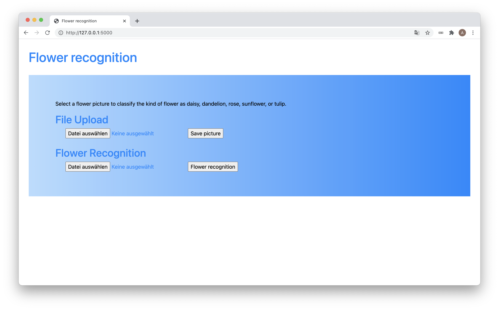

# early-sunrise
Choice of projects completed during Data Science Bootcamp at Spiced Academy Nov 2020 to Feb 2021. 

See short description of each project below.

## DockerPipeline 
Pipeline of Tweepy, MongoDB, ETL Job, Postgres, Slack Bot services in Docker containers

Voted [Project of the Week](https://careerkarma.com/discussions/projects/data-pipeline-analysing-sentiment-399/) on careerkarma.com Mar 29, 2021

## Gapminder
Animated visualisation of gapminder population data (see gapminder.org)

## Recommender
Recommender web app - start website.py in terminal, call http://127.0.0.1:5000/ in browser

## TempForecast_Map
Time Series of Berlin temperatures used for trend analysis and temperature forecast; visualisation on map for all Berlin districts

## Kaggle
Kaggle competition Titanic classification problem solved with Logistic regression and Decision tree

## Kaggle Bike share
Kaggle competition Bike Share regression problem solved with Linear regression and Poisson regression

## Keras_TensorFlow
Deep learning on MNIST data set with FFNN and CNN

--- 

## Flower Recognition
Web app to upload flower picture and have it recognized as one of five flower types by using deep learning model see https://github.com/jesierski/splendid-day

 

 